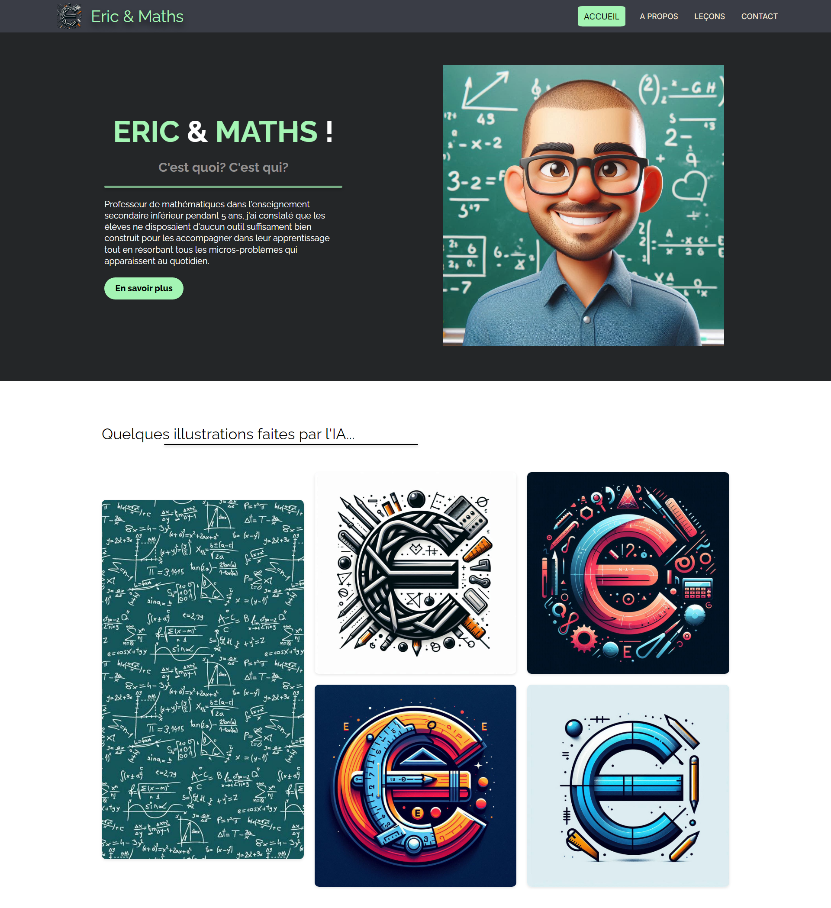

<h1 align="center"> ✨ First Independent HTML/SCSS Project ✨ </h1>

### 🌐 Demo / Preview


---

### ✏️ **Description**
This is one of my very first projects in web development, where I practiced structuring sections in HTML and styling with SCSS. This project was created independently and served as a mockup for a larger future project. Although this mockup no longer aligns with my vision three months later, it showcases my skills after just a few weeks of learning to code.

---

### 💻 **Technologies Used**
- **HTML5**: For structuring the layout of the page.
- **SCSS**: For styling, organization, and reusable components.

---

### **Key Features** 🚀
🎯 A complete mockup design: Built independently to practice HTML and SCSS.

🎨 Demonstrates progress: Highlights my level of skill after just a few weeks of learning.

📚 Foundation for learning: A stepping stone to mastering web development fundamentals.

### 🛠️ **Installation & Usage**
1. Clone the repository:
   ```bash
   git clone https://github.com/HUYBERIC/Eric-Maths.git
   cd Eric-Maths

---

<h1 align="center"> ✨ Premier projet HTML/SCSS en autonomie ✨ </h1>

---

### ✏️ **Description**
Il s'agit de l'un de mes tout premiers projets en développement web, où j'ai pratiqué la structuration des sections en HTML et le stylisme avec SCSS. Ce projet a été réalisé en totale autonomie et servait de maquette pour un futur projet plus ambitieux. Même si cette maquette ne me correspond plus aujourd'hui, elle témoigne de mon niveau après seulement quelques semaines d'apprentissage.

---

### 💻 **Technologies utilisées**
- **HTML5** : Pour structurer la mise en page.
- **SCSS** : Pour le style, l'organisation et les composants réutilisables.

---

### **Caractéristiques principales** 🚀
🎯 Une maquette complète : Réalisée indépendamment pour pratiquer le HTML et le SCSS.

🎨 Témoignage de progrès : Illustre mon niveau après seulement quelques semaines d'apprentissage.

📚 Base pour apprendre : Une étape essentielle pour maîtriser les bases du développement web.

### 🛠️ **Installation & Utilisation**
1. Cloner le dépôt:
  ```bash
  git clone https://github.com/HUYBERIC/Eric-Maths.git
  cd Eric-Maths